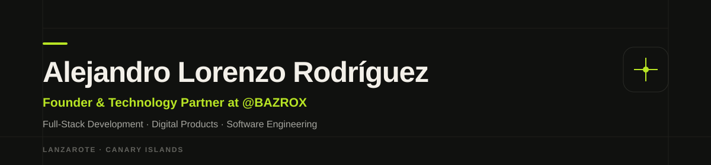
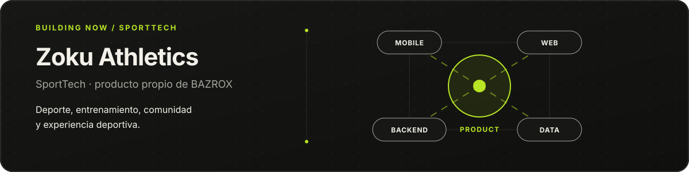
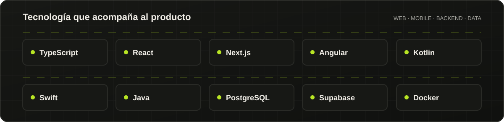

 

  

Lanzarote · Canary Islands · Spain

---

## Sobre mí

Soy **Alejandro Lorenzo Rodríguez**, desarrollador *full-stack* y **Founder & Technology Partner en BAZROX**. Trabajo cerca del punto donde se cruzan producto y código: primero entiendo qué necesita el negocio, después planteo una solución y la llevo hasta producción.

Me muevo entre web, aplicaciones móviles, *backend*, API, datos, automatización e IA aplicada según lo que cada producto necesita. No parto de un stack cerrado; parto del problema.

Hoy mi actividad profesional se articula desde **[BAZROX](https://bazrox.com)** y también construyo productos propios como **[Zoku Athletics](https://zokuathletics.com)**. Este GitHub recoge la parte pública de ese recorrido; buena parte del trabajo profesional actual vive en repositorios privados.

Vivo en Lanzarote, entreno CrossFit y siempre que puedo estoy al aire libre. Esa relación cotidiana con el deporte también está detrás de Zoku Athletics.

---

## Ahora mismo

**[Zoku Athletics](https://zokuathletics.com)** es un producto propio de BAZROX actualmente en desarrollo. Su construcción conecta aplicaciones móviles, web, *backend*, datos, UX/UI y arquitectura alrededor del deporte, el entrenamiento, la comunidad y la experiencia deportiva.

`Kotlin` · `Jetpack Compose` · `Next.js` · `Supabase`

En paralelo, construyo **BAZROX** como *Digital Product Studio & Technology Partner*: una forma de trabajar en la que producto, diseño e ingeniería forman parte de la misma conversación.

---

## Tecnología

<strong>Explorar herramientas y tecnologías</strong>

 

**Lenguajes y web** 
<kbd>TypeScript</kbd> <kbd>JavaScript</kbd> <kbd>Java</kbd> <kbd>Python</kbd> <kbd>HTML</kbd> <kbd>CSS</kbd> <kbd>Angular</kbd> <kbd>React</kbd> <kbd>Next.js</kbd> <kbd>Tailwind CSS</kbd> <kbd>Bootstrap</kbd>

**Aplicaciones móviles** 
<kbd>Kotlin</kbd> <kbd>Jetpack Compose</kbd> <kbd>Android Studio</kbd> <kbd>Swift</kbd> <kbd>SwiftUI</kbd> <kbd>Xcode</kbd>

**Backend y datos** 
<kbd>Supabase</kbd> <kbd>Firebase</kbd> <kbd>Neon</kbd> <kbd>PostgreSQL</kbd> <kbd>MySQL</kbd> <kbd>MariaDB</kbd> <kbd>MongoDB</kbd> <kbd>SQLite</kbd> <kbd>Oracle</kbd>

**IA y automatización** 
<kbd>Claude Code</kbd> <kbd>Anthropic API</kbd> <kbd>Gemini</kbd> <kbd>OpenCode</kbd> <kbd>Hugging Face</kbd> <kbd>Ollama</kbd> <kbd>LLM</kbd>

**DevOps y herramientas** 
<kbd>Git</kbd> <kbd>GitHub</kbd> <kbd>Docker</kbd> <kbd>Google Cloud</kbd> <kbd>Figma</kbd> <kbd>ClickUp</kbd>

---

## Una parte de lo que he construido

### [Zoku Athletics](https://zokuathletics.com)

PRODUCTO ACTUAL · BAZROX

Plataforma SportTech en desarrollo alrededor del deporte, el entrenamiento, la comunidad y la experiencia deportiva. Es el producto propio en el que hoy convergen mi trabajo de producto, mobile, web, *backend*, datos, UX/UI y arquitectura.

`Kotlin` · `Jetpack Compose` · `Next.js` · `Supabase`

### [Task Manager API](https://github.com/byAlexLR/TaskManager-API)

API REST para gestionar tareas con creación, edición, filtros, paginación y estadísticas. Construida con **Java, Spring Boot y MongoDB**.

### [WaveFit](https://github.com/byAlexLR/WaveFit)

Experiencia web bilingüe centrada en entrenamiento, comunidad y planes personalizados, con una interfaz adaptable desarrollada con HTML, CSS y JavaScript. **[Ver demo](https://byalexlr.github.io/WaveFit/)**.

### [Planéate](https://ies-haria-cfgs.github.io/planeateharia/)

Sitio web institucional para un centro de Formación Profesional de Informática en Lanzarote, desarrollado en equipo y publicado como experiencia web completa.

Además de estos proyectos públicos, he desarrollado soluciones para empresas privadas cuyos repositorios no son visibles.

---

## ¿Hablamos?

Si estás construyendo, mejorando o replanteando un producto digital, podemos hablar.

  

 

